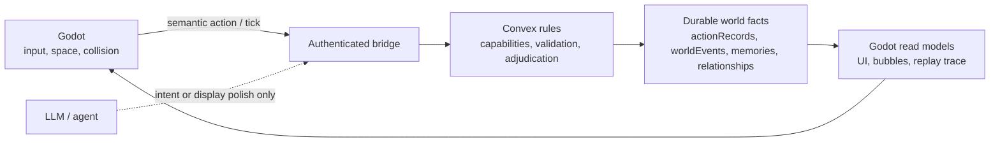

# Worldweft

[](https://github.com/hX1-dev/worldweft/actions/workflows/verify.yml)

> **Worlds weave themselves.**
>
> Agents think in language. Worlds endure in rules.

Worldweft is an open foundation for durable, evolving agent worlds in Godot.
Its agents can act, remember, form relationships, follow schedules, and change
the world even when no player is watching. A player participates in the world;
they are not the reason the world runs.

**Status:** alpha reference implementation. The durable bridge, semantic action
pipeline, replay trace, focused tests, and Godot contracts are working. The
current Qinglan/Xianxia world is a reference fixture, not the future public
example world.

## Why Worldweft

Most LLM NPC demos are response systems: a player speaks, an NPC answers.
Worldweft is a simulation contract:

- **Agents propose; rules decide.** An LLM can propose an intention or polish
  presentation text, but cannot write a fact into the world.
- **The world has one durable authority.** Convex validates actions and owns
  world events, action records, memories, and relationships.
- **Space is embodied, not authoritative.** Godot owns movement, collision,
  input, and presentation without becoming a second world-state database.
- **Every consequence can be inspected.** A semantic action resolves through
  `actionRecord` and `worldEvent` into a replayable Godot presentation trace.



## What Ships Now

- Authenticated Godot bridge for world state, region state, capabilities,
  actions, ticks, actor context, and action-record readback.
- Formal semantic actions including talk, gift, trade, spar, teaching,
  cultivation, breakthrough, arrival, and exploration.
- A durable tick -> action -> event -> action-record trace in the Godot client.
- Presentation separation: rule-owned summaries stay factual while display text
  can evolve independently.
- Capability, spatial-presence, idempotency, risk-confirmation, and tick-only
  observation contracts.
- A Godot reference client with resident inspection, action selection, event
  bubbles, schedule/route preview, and replay/debug affordances.

## Quick Start

**Requirements:** Node.js 20-24 and Godot 4.3 or newer. The current reference
gate is verified with Node 24 and Godot 4.7.

```bash
npm ci
GODOT_BIN=/path/to/Godot npm run godot:check-core
```

This imports required Godot assets, typechecks and lints the bridge, runs 72
focused unit tests, and validates the headless Godot contracts. For a live
Convex backend and Godot client, follow
[godot-taixu-client/PRODUCTION_RUNBOOK.md](godot-taixu-client/PRODUCTION_RUNBOOK.md).

## Reference Demo

The repository contains a runnable Godot reference client, not a polished game
demo. That is deliberate: v0.1 proves the authority boundary and its tests
before presenting a finished setting. A short public capture and a neutral
example world are the next demonstration milestones.

## Roadmap

- **v0.1:** publish the tested Convex-Godot foundation and reference world.
- **v0.2:** replace the domain-specific fixture with a neutral example world
  and public, repeatable demo capture.
- **v0.3:** add configurable world packs, richer replay tooling, and optional
  LLM presentation polish without weakening durable-rule authority.

## Learn More

- [Architecture](ARCHITECTURE.md): authority boundaries and runtime flow.
- [Positioning](POSITIONING.md): relationship to AI Town and Microverse.
- [Production runbook](godot-taixu-client/PRODUCTION_RUNBOOK.md): live local setup.
- [Contributing](CONTRIBUTING.md): rules for safe extensions.
- [Security](SECURITY.md) and [support](SUPPORT.md).

## Acknowledgements

Worldweft carries forward lessons and selected MIT-licensed code from
[AI Town](https://github.com/a16z-infra/ai-town), while taking inspiration from
the Godot-native multi-agent direction of
[Microverse](https://github.com/KsanaDock/Microverse). See [NOTICE.md](NOTICE.md)
for attribution and fixture-asset notes.

Released under the [MIT License](LICENSE).
