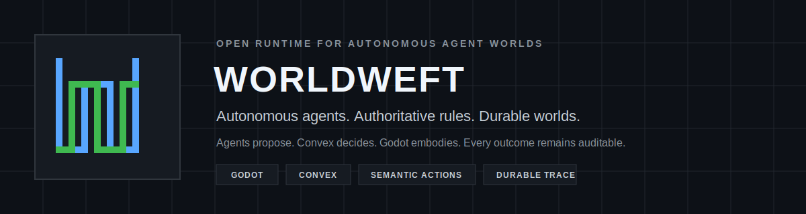
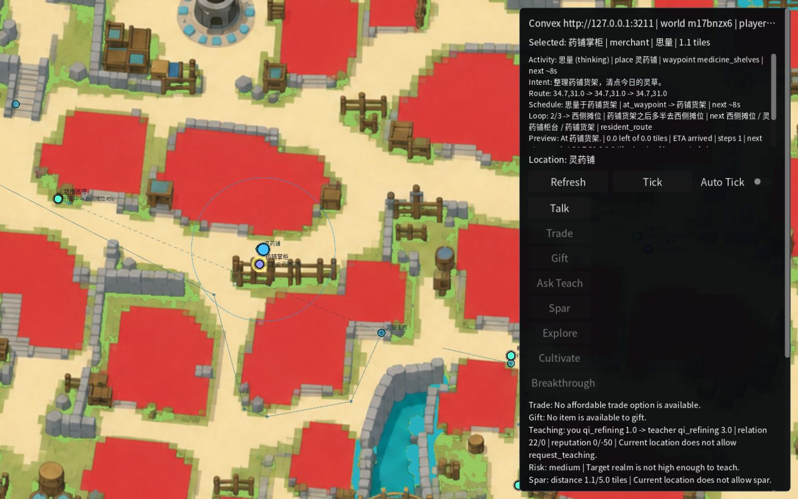

<p align="center">
  
</p>

<p align="center">
  <a href="https://github.com/hX1-dev/worldweft/actions/workflows/verify.yml"></a>
  <a href="LICENSE"></a>
  
  
</p>

<p align="center">
  <a href="#architecture">Architecture</a> &middot;
  <a href="#run-the-core-gate">Quick start</a> &middot;
  <a href="godot-taixu-client/PRODUCTION_RUNBOOK.md">Runbook</a> &middot;
  <a href="CONTRIBUTING.md">Contributing</a>
</p>

Worldweft is an open runtime for persistent, autonomous agent worlds. It pairs
a Godot client for embodied play with a Convex backend for rule adjudication,
durable state, and replayable history. Players, agents, and scheduled systems
may propose actions; only the world runtime can turn those proposals into facts.

This is not an NPC chat wrapper. The simulation continues whether or not a
player is watching, and every real consequence remains inspectable after it
happens.

## At A Glance

| 9 semantic actions | 7 bridge surfaces | 72 focused tests | 2 live viewport gates |
| :---: | :---: | :---: | :---: |
| Talk through exploration | State through trace readback | Rules, policy, spatial, replay | 1024x720 and 1440x900 |

> **Alpha reference implementation.** The authority boundary, semantic action
> pipeline, replay trace, focused test suite, and Godot contracts are
> operational. Qinglan is a real integration fixture, not the final public
> example world.

## System Contract

| Concern | Owner | Non-negotiable rule |
| --- | --- | --- |
| Movement, collision, input, and UI | Godot | Embodies the world but never owns durable facts. |
| Validation, adjudication, and persistence | Convex | The only authority that may create or change world facts. |
| Intent and optional presentation polish | Agent / LLM | May propose; cannot directly write state, events, or records. |
| Evidence and replay | Durable records | Every real outcome is traceable through records and events. |

## Reference Client



The connected debug surface above selects a real resident, loads actor context
and capabilities, advances a tick, and exposes the resulting trace. The Qinglan
fixture makes spatial presence, route preview, semantic actions, and durable
readback testable end to end; it is deliberately not presented as a finished
game or neutral starter world.

## Architecture


- Godot sends a **semantic action**, never a claimed outcome or authored story.
- Convex verifies identity, semantic presence, capability, idempotency,
  prerequisites, and risk before applying canonical rules.
- `actionRecords`, `worldEvents`, relationships, memories, and world state are
  durable rule-owned facts.
- `bubbleText`, `displayText`, and `presentationSource` form a separate
  presentation layer that cannot rewrite those facts.
- A tick without a durable change returns `tickOnly`; it never fabricates a
  `worldEvent` to make the client appear active.

Read the full [architecture](ARCHITECTURE.md) and the durable
[bridge contract](godot-taixu-client/BRIDGE_TESTS.md).

## Run The Core Gate

**Requirements:** Node.js 20-24 and Godot 4.3+. The published baseline is
exercised with Node 24 and Godot 4.7.

```bash
npm ci
GODOT_BIN=/path/to/Godot npm run godot:check-core
```

The gate imports Godot assets, verifies the release-source boundary, typechecks
and lints the bridge, runs 72 focused unit tests, and validates headless Godot
contracts. A connected session and release evidence are documented in the
[production runbook](godot-taixu-client/PRODUCTION_RUNBOOK.md).

## What Ships Today

- Authenticated world, region, capability, action, tick, actor-context, and
  action-record bridge surfaces.
- Formal conversation, gift, trade, sparring, teaching, cultivation,
  breakthrough, arrival, and exploration actions.
- An inspectable `tick -> action -> event -> actionRecord` lifecycle.
- Capability, semantic-presence, idempotency, risk-confirmation, presentation,
  and tick-only contracts.
- Resident inspection, action selection, event bubbles, route preview, and
  replay/debug tooling in the Godot reference client.

## Repository Map

| Path | Responsibility |
| --- | --- |
| [`convex/`](convex) | Authoritative bridge, rule layer, durable contracts, and tests. |
| [`godot-taixu-client/`](godot-taixu-client) | Godot reference client, presentation, and contract tooling. |
| [`data/`](data) | Reference-world spatial and fixture data. |
| [`ARCHITECTURE.md`](ARCHITECTURE.md) | Authority model, runtime flow, and public boundary. |
| [`godot-taixu-client/HARDENING_PLAN.md`](godot-taixu-client/HARDENING_PLAN.md) | Reliability and maintainability roadmap. |

## Scope And Roadmap

Worldweft is an infrastructure baseline, not a finished game. Final maps,
economy, broad content authoring, art pipelines, and player progression belong
above this layer.

- **Current:** tested Convex-Godot authority boundary and Qinglan reference world.
- **Next:** neutral example world, repeatable public demo capture, and cleaner
  public package boundaries.
- **Later:** configurable world packs, richer replay tooling, and optional LLM
  presentation polish without weakening rule authority.

## Project Links

- [Contributing](CONTRIBUTING.md)
- [Security policy](SECURITY.md)
- [Support](SUPPORT.md)
- [Code of conduct](CODE_OF_CONDUCT.md)
- [Compatibility boundary](COMPATIBILITY.md)
- [Positioning and influences](POSITIONING.md)

## Acknowledgements

Worldweft carries forward lessons and selected MIT-licensed code from
[AI Town](https://github.com/a16z-infra/ai-town), while taking inspiration from
the Godot-native multi-agent direction of
[Microverse](https://github.com/KsanaDock/Microverse). See [NOTICE.md](NOTICE.md)
for attribution and fixture-asset notes.

Released under the [MIT License](LICENSE).
