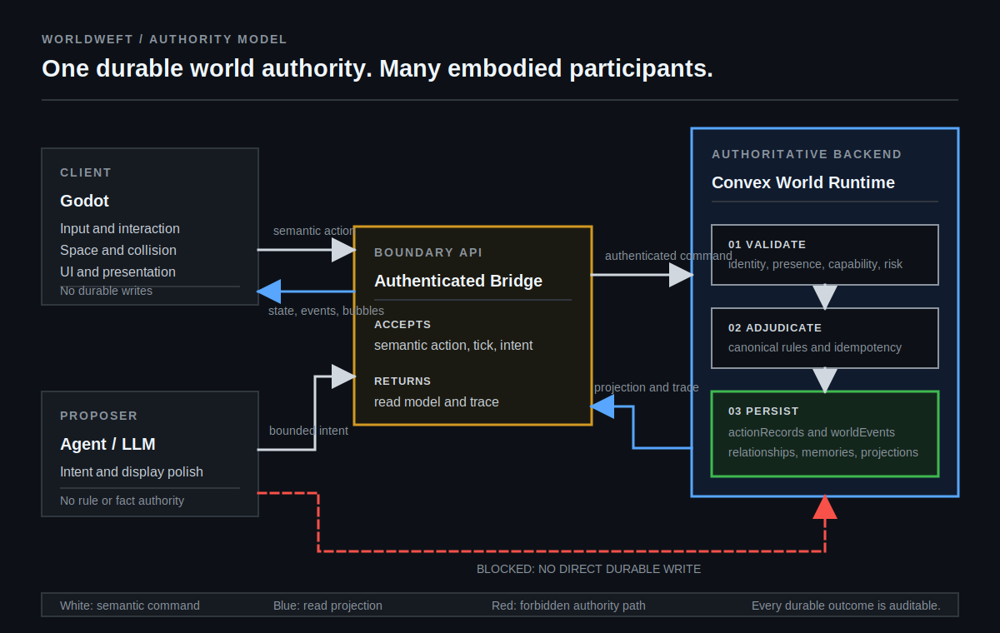

# Worldweft

[](https://github.com/hX1-dev/worldweft/actions/workflows/verify.yml)
[](LICENSE)

**A durable simulation runtime for autonomous agent worlds.**

Worldweft combines a Godot client with a Convex-governed world runtime. Agents,
players, and scheduled systems may propose semantic actions; only the runtime
validates those actions, applies rules, and persists their consequences. The
world continues whether or not a player is watching.

> **Status: alpha reference implementation.** The authority boundary, semantic
> action pipeline, replay trace, focused test suite, and headless Godot
> contracts are operational. Qinglan is a real reference fixture, not the
> public identity or final example world.

## The Contract

| Concern | Owner | Rule |
| --- | --- | --- |
| Movement, collision, input, and UI | Godot | Embodies the world but never owns durable facts. |
| Validation, adjudication, and persistence | Convex | The only authority that may create or change world facts. |
| Intent and optional presentation polish | Agent / LLM | May propose; cannot directly write state, events, or records. |
| Evidence and replay | `actionRecords`, `worldEvents`, relationships, memories | Every real outcome is inspectable after the fact. |

## Architecture



The distinction is intentional:

- Godot sends a **semantic action**, never a claimed outcome or story text.
- Convex verifies identity, semantic presence, capabilities, idempotency,
  prerequisites, and risk confirmation before applying canonical rules.
- Rule-owned summaries remain factual. `bubbleText`, `displayText`, and
  `presentationSource` are a separate presentation layer.
- A tick without a durable change returns a `tickOnly` observation. It never
  fabricates a `worldEvent`.

Read the full [architecture](ARCHITECTURE.md) and the durable
[bridge contract](godot-taixu-client/BRIDGE_TESTS.md).

## What Is Included

- Authenticated endpoints for world state, region state, capabilities, actions,
  ticks, actor context, and action-record readback.
- Formal actions for conversation, gift, trade, sparring, teaching,
  cultivation, breakthrough, arrival, and exploration.
- An inspectable `tick -> action -> event -> actionRecord` trace in the Godot
  reference client.
- Capability, spatial-presence, idempotency, risk-confirmation, presentation,
  and tick-only contracts.
- A Godot reference surface with resident inspection, action selectors, event
  bubbles, route preview, and replay/debug affordances.

## Run The Core Gate

**Requirements:** Node.js 20-24 and Godot 4.3+. The current gate is exercised
with Node 24 and Godot 4.7.

```bash
npm ci
GODOT_BIN=/path/to/Godot npm run godot:check-core
```

This imports required Godot assets, checks the bridge source boundary,
typechecks and lints the runtime, runs 72 focused unit tests, and validates the
headless Godot contracts. For a live backend and client session, use the
[production runbook](godot-taixu-client/PRODUCTION_RUNBOOK.md).

## Repository Map

| Path | Purpose |
| --- | --- |
| [`convex/`](convex) | Authoritative HTTP bridge, rule layer, durable contracts, and tests. |
| [`godot-taixu-client/`](godot-taixu-client) | Godot reference client, scenes, presentation, and contract tooling. |
| [`data/`](data) | Reference-world spatial and fixture data. |
| [`ARCHITECTURE.md`](ARCHITECTURE.md) | Authority model, runtime flow, and public boundary. |
| [`godot-taixu-client/HARDENING_PLAN.md`](godot-taixu-client/HARDENING_PLAN.md) | Tracked reliability and maintainability work. |

## Deliberate Scope

Worldweft is an infrastructure baseline, not a finished game or a generic LLM
chat demo. Final maps, economy, content authoring, art pipelines, and player
progression sit above this layer. The next public milestones are a neutral
example world, a repeatable demo capture, configurable world packs, and richer
replay tooling.

## Contributing And Support

- [Contributing](CONTRIBUTING.md)
- [Security policy](SECURITY.md)
- [Support](SUPPORT.md)
- [Code of conduct](CODE_OF_CONDUCT.md)
- [Compatibility boundary](COMPATIBILITY.md)

## Acknowledgements

Worldweft carries forward lessons and selected MIT-licensed code from
[AI Town](https://github.com/a16z-infra/ai-town), while taking inspiration from
the Godot-native multi-agent direction of
[Microverse](https://github.com/KsanaDock/Microverse). See [NOTICE.md](NOTICE.md)
for attribution and fixture-asset notes.

Released under the [MIT License](LICENSE).
